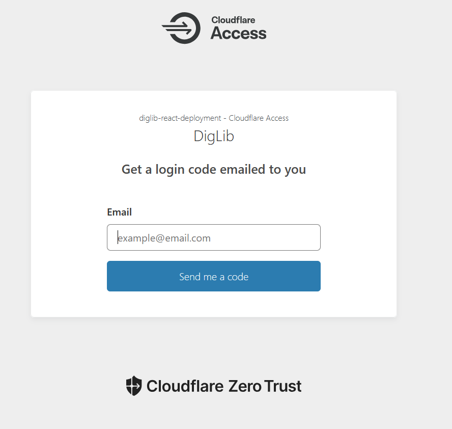
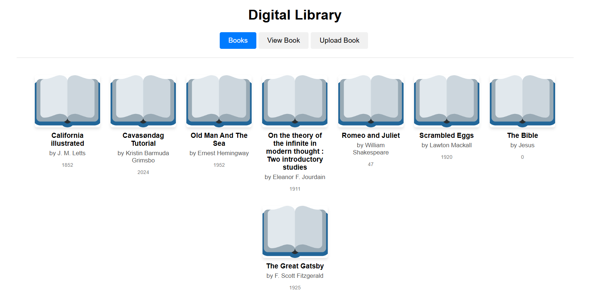
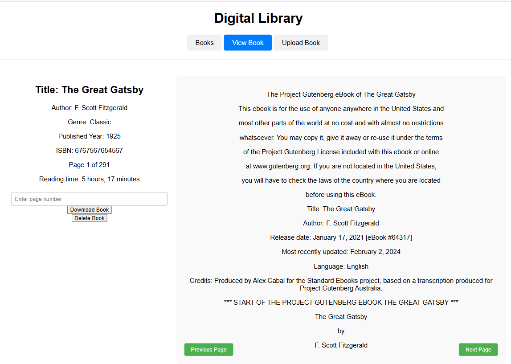
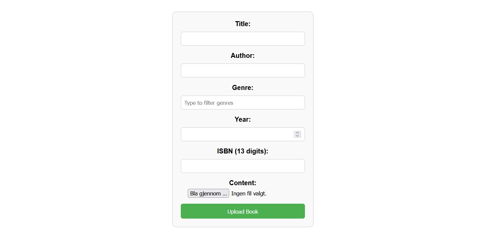
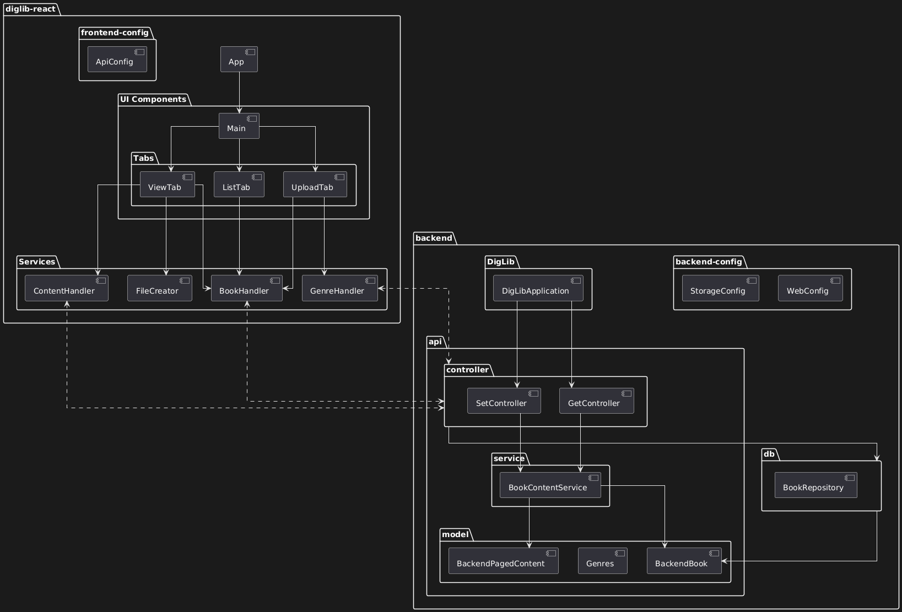
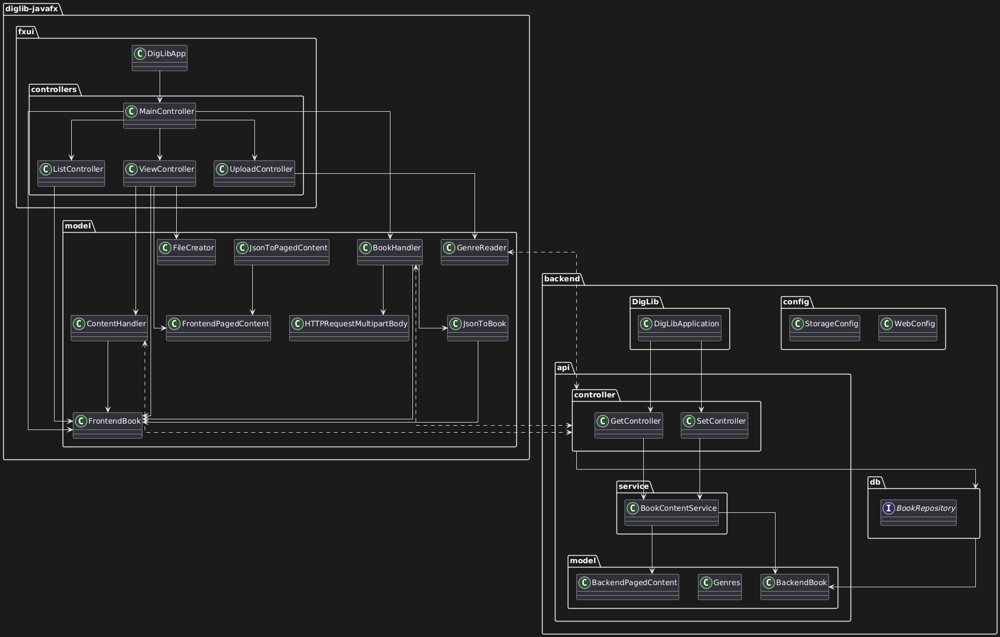
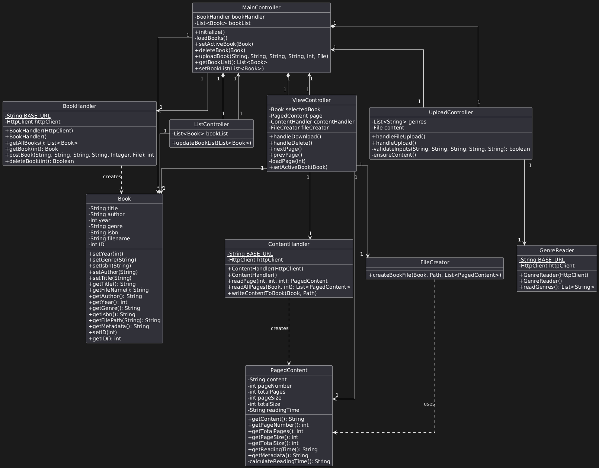
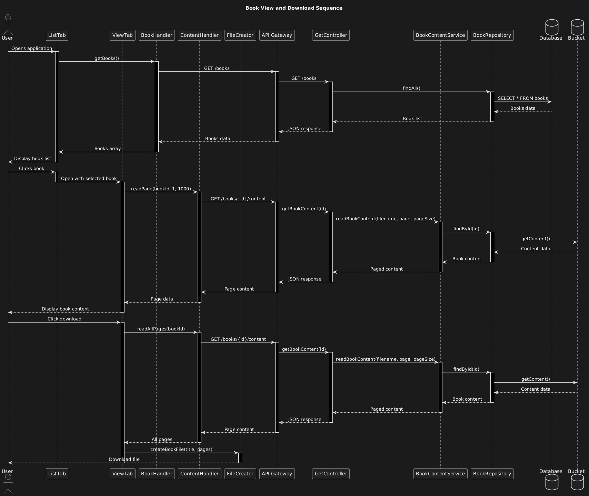

# About the application

>&#8203;    
>[Home](../README.md)&nbsp;&nbsp;&nbsp;&nbsp;&nbsp;&nbsp;&nbsp;&nbsp; 
[About](../docs/README.md)&nbsp;&nbsp;&nbsp;&nbsp;&nbsp;&nbsp;&nbsp;&nbsp;
[Development-Tools](../docs/release3/development-tools.md)&nbsp;&nbsp;&nbsp;&nbsp;&nbsp;&nbsp;&nbsp;&nbsp;
[API](../docs/release3/api-calls.md)&nbsp;&nbsp;&nbsp;&nbsp;&nbsp;&nbsp;&nbsp;&nbsp;
[Workhabits](../docs/release3/workflow.md)&nbsp;&nbsp;&nbsp;&nbsp;&nbsp;&nbsp;&nbsp;&nbsp;
[Tests](../docs/release3/tests.md)&nbsp;&nbsp;&nbsp;&nbsp;&nbsp;&nbsp;&nbsp;&nbsp;
[JavaFX](../client/diglib-javafx/README.md)&nbsp;&nbsp;&nbsp;&nbsp;&nbsp;&nbsp;&nbsp;&nbsp;
[React](../client/diglib-react/README.md)&nbsp;&nbsp;&nbsp;&nbsp;&nbsp;&nbsp;&nbsp;&nbsp;
[Backend](../backend/README.md)&nbsp;&nbsp;&nbsp;&nbsp;&nbsp;&nbsp;&nbsp;&nbsp;
[CI/CD](../docs/release3/gitlab-ci.md)&nbsp;&nbsp;&nbsp;&nbsp;&nbsp;&nbsp;&nbsp;&nbsp;
[Google-Cloud](../docs/release3/gcloud-setup.md)&nbsp;&nbsp;&nbsp;&nbsp;&nbsp;&nbsp;&nbsp;&nbsp;
[Cloudflare](../docs/release3/cloudflare-setup.md)&nbsp;&nbsp;&nbsp;&nbsp;&nbsp;&nbsp;&nbsp;&nbsp;
[Use-cases](../docs/release3/usercase.md)&nbsp;&nbsp;&nbsp;&nbsp;&nbsp;&nbsp;&nbsp;&nbsp;     
>&#8203;    

## Project Overview

The Digital Library project is an application designed to help students at NTNU find, share and read Books. When they first start the application, they will be greeted with a login screen provided by cloudflare. After entering their NTNU email and entering the code they received by email, they will be able to access the application. 

Once logged in, the user will be able to see a list of all books in the database. 

A user can then read a book by clicking on the book title or book image. The book will be displayed in the "View Book" tab, and the user can navigate through the book by clicking on the previous and next page buttons.

By clicking "Download Book" the user can download the book to their download folder.
By cliking "Delete Book" the user can delete the book from the library.

A user can then add books to the library by uploading a new book from a .txt file, and they can download books from the library to their local unit.

## Project Structure

The project is divided into three main parts:

1. **Backend**: The backend is built using Spring Boot and provides a REST API for the frontend applications. The backend is deployed on Google Cloud Platform.

2. **Web Application**: The web application is built using React and provides a graphical user interface for interacting with the DigLib application.

3. **Desktop Application**: The desktop application is built using JavaFX and provides a graphical user interface for interacting with the DigLib application.

### Key Features

* **Library Management**: Users can create and manage the shared library of books.
* **Input and Output**: Users can import and export books to and from the application.
* **Modular Design**: The application is divided into separate modules for better organization and maintainability.
* **User Authentication**: Only users with an NTNU email can access the application.

## Diagrams

### Package diagrams

Here are the package diagrams for the React web application and the JavaFX desktop application. The package diagrams show the structure of the applications and how the different packages are related to each other. The stapled lines represent the HTTP requests between the frontend and the backend.

* #### React

* #### JavaFX

### Class diagram for JavaFX 

We chose to exclude methods and fields that are not relevant for the class diagram to make it more readable. The class diagram shows the relationship between the classes in the JavaFX application, and focuses on business logic classes and their relationships.

### Sequence diagram for a normal user interaction with the react web application

This sequence diagram shows the interaction between the React web application and the backend when a user logs in, fetches the list of books, and downloads a book.

## Technology Stack

#### Backend
* Spring Boot: The backend is built using Spring Boot.
* REST API: The backend provides a REST API for the frontend applications.
* JPA: The backend uses JPA for database access.
* Google Cloud Platform: The backend is deployed on Google Cloud Platform.

#### Web Application
* React: The web application is built using React.
* EsLint: The application uses EsLint for code style checking.
* Prettier: The application uses Prettier for code formatting.
* Jest: The application uses Jest for unit testing.
* Axios: The application uses Axios for making HTTP requests.

#### Desktop Application
* JavaFX: The application uses JavaFX for the user interface.
* JaCoCO: The application uses JaCoCO for code coverage analysis.
* Checkstyle: The application uses Checkstyle for code style checking.
* SpotBugs: The application uses SpotBugs for static code analysis.
* JUnit: The application uses JUnit for unit testing.
* Mockito: The application uses Mockito for mocking in unit tests.

#### Common 
* Java: Both the backend and the desktop application are built using Java.
* Maven: The backend and the desktop application uses Maven for build automation and dependency management.
* Git: The application uses Git for version control.
* Gitlab CI/CD: Build and test pipeline for project to ensure concise and correct commits

