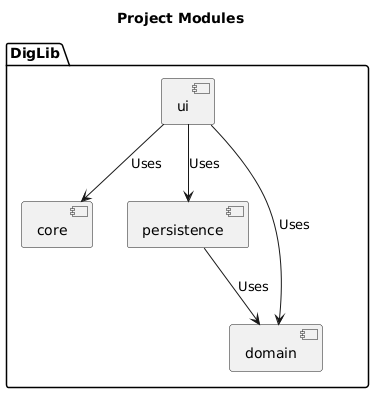
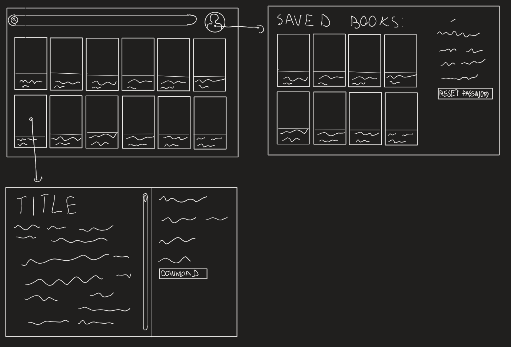

# V2.0
>&#8203;    
>[Home](../../README.md)    
>&#8203;    

The application is now a functional Digital Library. It has most of the intended features.

## Contents of this folder

* #### [Ai-tools](ai-tools.md)

## Current package diagram

## Scketch of the GUI when the project is finished

## Features

### Create domain module (#39)

Created a domain module to hold the domain classes.

### Delete docker (#33)

Removed docker from the project.

### implement JaCoCo display for test coverage (#30)

Implemented JaCoCo to display test coverage in the project.

### implement spotbugs (#28)

Implemented SpotBugs to find bugs in the code.

### Gitlab CI/CD pipeline (#22)

Implemented a Gitlab CI/CD pipeline for the project. The pipeline runs tests, checks code style and deploys the application to the server.

### Book upload (#13)

Implemented functionality for uploading books to the digital library.

### Book download (#18)

Implemented functionality for downloading books on users personal computer in .txt format.

### GUI redesign (#10)

Original GUI was completely redesigned from a table with a button to veiw and download books.

Features added:

* better book display using flow pane
* better book veiwer using text with buttons for downloading, deleting and saving to library
* book upload using a form with fields for title, author, genre, year and file upload
* tab panes for separating functionality

### Automatic tests (#17)

Added Jacoco for test coverage, Checkstyle to enforce code style and SpotBugs to find bugs.

### Redesign backend for JSON support (#11)

Redesigned the backend to use JSON instead of CSV in the database.

### Restructure into 3 modules (#9, #14)

Restructured the architecture to 3 modules. One module for UI, one for core and one for persistence.

### Added JUnit tests (#15)

Added JUnit tests to cover code written for this realise.
