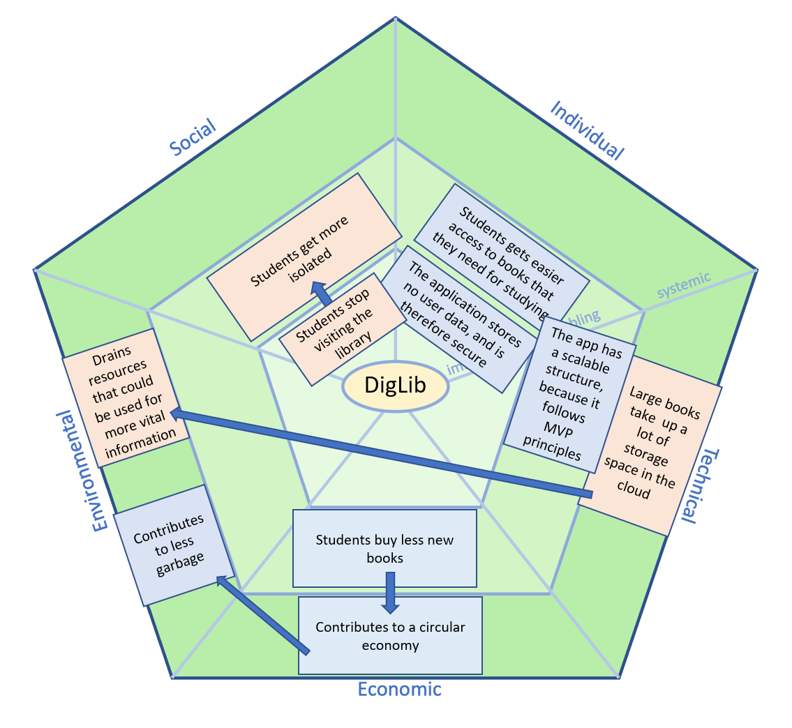

# Sustainability

>&#8203;    
>[Go back](./README.md)    
>&#8203;  

In examining the sustainability consequences of a digital library application, it’s clear that while the platform offers several positive impacts across social, individual, technical, environmental, and economic areas, there are also significant trade-offs to consider.

**Socially**, the shift from physical to digital libraries presents both challenges and opportunities. Immediately, one downside is that students may stop visiting physical libraries. This shift can impact the sense of community that libraries provide as public learning spaces. A library is not only a resource center but also a place for social interaction and collaboration. With students potentially becoming more isolated, the loss of social connection may have a ripple effect on student well-being. In an increasingly digital world, these potential consequences call for a balance, ensuring that physical library spaces can coexist with digital solutions.

**On an individual level**, the application offers clear advantages, especially regarding data security. By not storing user data, the app minimizes privacy concerns, which is essential in an age where data breaches are a regular occurrence. Additionally, by providing easier access to study materials, the digital library serves as an accessible resource for students, especially those who may face obstacles in accessing physical libraries. This accessibility supports learning and academic success by reducing logistical barriers to essential resources.

**Technically**, the application’s adherence to Model View Controller (MVC) principles promotes scalability, enabling it to expand with user demand. This structure minimizes resource use and allows for efficient growth, which can be advantageous for the sustainability of the platform. However, from a systemic perspective, there are challenges related to cloud storage. Large digital books consume substantial storage space, which increases demand on data centers. These centers are energy-intensive and contribute to carbon emissions. While cloud storage provides users with convenience, reliance on it raises questions about resource efficiency and environmental responsibility.

**Environmentally**, the digital library offers mixed results. On one hand, it contributes to waste reduction by eliminating the need for physical books that could eventually end up as waste. This has significant implications for resource conservation and waste management, as fewer books printed mean less paper, ink, and physical storage space required. On the other hand, the energy demands of data centers may drain resources that could be allocated to more vital applications, raising concerns about the sustainability of information prioritization. It’s crucial to consider the environmental trade-offs of digital libraries, especially in terms of energy usage and emissions.

**Economically**, the digital library can positively impact students and broader economic systems. By reducing the need to purchase new books, students save money, making education more affordable. This aligns with a broader economic shift towards the circular economy, as digital libraries allow for the reuse of resources (in this case, digital copies of books) and reduce the demand for new physical materials. This circular approach promotes sustainability and resource efficiency, addressing the rising costs of education and reducing consumption.

In conclusion, while this digital library application has several benefits, particularly in terms of accessibility, security, and cost-effectiveness, there are notable challenges that need attention. Social isolation and environmental impacts from data center demands are significant drawbacks that highlight the need for a more holistic approach to digital library implementation. To maximize the sustainability benefits, developers might explore options to reduce cloud storage requirements, such as compression technology or local caching, while fostering community engagement to counteract isolation. By balancing these factors, the digital library could better align with long-term sustainability goals.

We used the susAF framework to analyze the sustainability of our application. Here is the susAD diagram we made while reflecting on the sustainability of our application:

