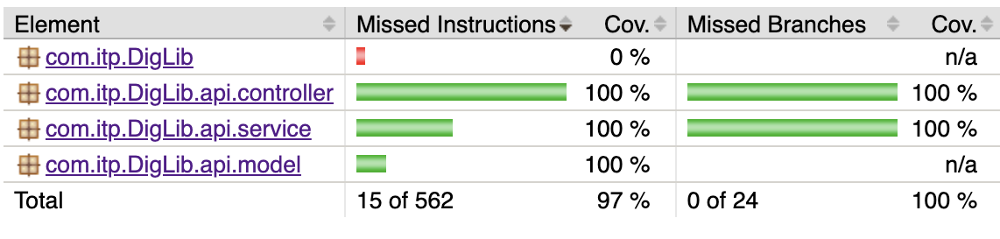
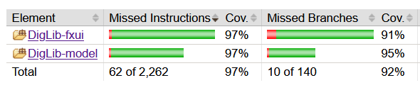
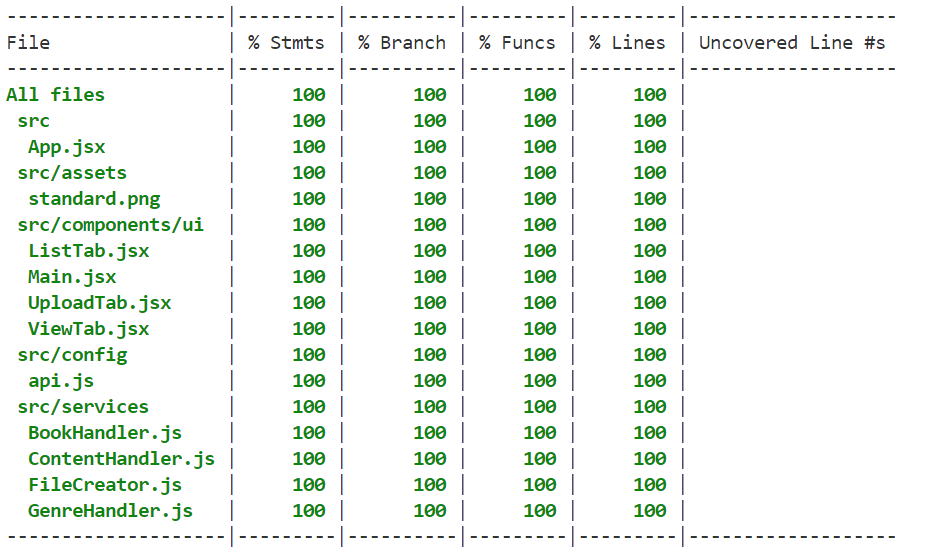

# Tests

>&#8203;    
>[Home](../../README.md)&nbsp;&nbsp;&nbsp;&nbsp;&nbsp;&nbsp;&nbsp;&nbsp; 
[About](../../docs/README.md)&nbsp;&nbsp;&nbsp;&nbsp;&nbsp;&nbsp;&nbsp;&nbsp;
[Development-Tools](../../docs/release3/development-tools.md)&nbsp;&nbsp;&nbsp;&nbsp;&nbsp;&nbsp;&nbsp;&nbsp;
[API](../../docs/release3/api-calls.md)&nbsp;&nbsp;&nbsp;&nbsp;&nbsp;&nbsp;&nbsp;&nbsp;
[Workhabits](../../docs/release3/workflow.md)&nbsp;&nbsp;&nbsp;&nbsp;&nbsp;&nbsp;&nbsp;&nbsp;
[Tests](../../docs/release3/tests.md)&nbsp;&nbsp;&nbsp;&nbsp;&nbsp;&nbsp;&nbsp;&nbsp;
[JavaFX](../../client/diglib-javafx/README.md)&nbsp;&nbsp;&nbsp;&nbsp;&nbsp;&nbsp;&nbsp;&nbsp;
[React](../../client/diglib-react/README.md)&nbsp;&nbsp;&nbsp;&nbsp;&nbsp;&nbsp;&nbsp;&nbsp;
[Backend](../../backend/README.md)&nbsp;&nbsp;&nbsp;&nbsp;&nbsp;&nbsp;&nbsp;&nbsp;
[CI/CD](../../docs/release3/gitlab-ci.md)&nbsp;&nbsp;&nbsp;&nbsp;&nbsp;&nbsp;&nbsp;&nbsp;
[Google-Cloud](../../docs/release3/gcloud-setup.md)&nbsp;&nbsp;&nbsp;&nbsp;&nbsp;&nbsp;&nbsp;&nbsp;
[Cloudflare](../../docs/release3/cloudflare-setup.md)&nbsp;&nbsp;&nbsp;&nbsp;&nbsp;&nbsp;&nbsp;&nbsp;
[Use-cases](../../docs/release3/usercase.md)&nbsp;&nbsp;&nbsp;&nbsp;&nbsp;&nbsp;&nbsp;&nbsp;     
>&#8203; 

## Table of Contents
- [Tests](#tests)
  - [Table of Contents](#table-of-contents)
  - [Overview](#overview)
    - [View test coverage](#view-test-coverage)
    - [Run tests](#run-tests)
  - [Unit tests](#unit-tests)
  - [Integration tests](#integration-tests)
    - [JavaFX integration tests](#javafx-integration-tests)
    - [React integration tests](#react-integration-tests)
      - [**Problems with testing**](#problems-with-testing)
    - [Backend integration tests](#backend-integration-tests)
  - [End-to-end tests](#end-to-end-tests)
  - [Deployment tests](#deployment-tests)
  - [Static code analysis](#static-code-analysis)
    - [Current test coverage:](#current-test-coverage)

## Overview

We use a combination of unit tests, integration tests, end-to-end (E2E) tests, and deployment tests to ensure the quality and reliability of our application.

- **Unit Tests**: Verify that individual components work correctly in isolation.
- **Integration Tests**: Test the interactions between different components within the clients and the server.
- **End-to-End (E2E) Tests**: Validate the entire system's functionality from the user's perspective after deployment.
- **Deployment Tests**: Ensure that the deployed server functions correctly in its production environment.

Additionally, we use static code analysis tools to detect bugs, enforce code style rules, and measure test coverage. All tests are run automatically as part of our CI/CD pipeline to ensure that the code remains in a working state at all times.

### View test coverage

- [JavaFX JaCoCo index.html](../../client/diglib-javafx/aggregate/target/site/jacoco-aggregate/index.html)
- [Backend JaCoCo index.html](../../backend/target/site/jacoco/index.html)

### Run tests

If you want to run the tests yourselves, go to the respective part you want to test. This page describes how our tests are structured and what they cover.

- [Test the React client](../../client/diglib-react/README.md#run-unit-and-integration-tests)
- [Test the JavaFX client](../../client/diglib-javafx/README.md#run-integration-tests)
- [Test the Backend](../../backend/README.md#running-tests)

## Unit tests

We are aiming for a unit-test coverage of 90% or more in the DigLib application. This is to ensure that the code is well-tested and that we can catch any potential bugs early in the development process.

We are using JUnit tests to test the different parts of the application, including the backend server and the JavaFX client. We are using Jest to test the React client.

With unit tests we are testing how each individual component of the React client works in isolation. That means that all methods outside the component are mocked. Additional we have unit tests for the services that are used in the React client. Here the api

We are also using GitLab CI/CD to automate the testing process and ensure that the tests are run on every commit. This helps us catch any potential issues early in the development process and ensures that the code is always in a working state.

## Integration tests

We are using integration tests to test the interaction between different parts of the application. This includes testing how the different javaFX components interact with each other, and how the backend components interact. We are using JUnit tests to write the integration tests, and are aiming to test all key components of the application.

For the React client, we are using Jest to write integration tests. We are testing how the different components interact with each other. We are aiming to test all key components of the react client.

### JavaFX integration tests

In the JavaFX client, we focus on testing the interaction between the UI components and the backend services. The integration tests ensure that the application behaves correctly when performing operations such as loading books, uploading new books, and deleting books.

The integration tests use the following components:

- **TestFX**: A testing framework for JavaFX applications that allows us to simulate user interactions and verify UI behavior.
- **MockHttpClient**: A custom mock implementation of HttpClient that simulates backend responses without making real HTTP requests.
- **JUnit 5**: The testing framework used to write and run the tests.

The tests cover the main user interactions:

- **Loading the initial book list**: Verifies that the application correctly loads and displays the list of books from the backend.
- **Uploading a new book**: Simulates the process of filling out the book upload form and verifies that the book is correctly uploaded and displayed in the list.
- **Changing tabs**: Ensures that switching between different tabs (e.g., view, list) works correctly and displays the appropriate content.
- **Deleting a book**: Simulates the deletion of a book and verifies that it is removed from the list and the view is updated accordingly.

The tests provide comprehensive coverage of the main user interactions with the JavaFX application, ensuring that the UI and backend integration work as expected.

### React integration tests

The integration test for the React client focuses on verifying the functionality of switching between different tabs and performing operations within those tabs. The key aspects tested include:

1. **Mocking API Calls**:
- Uses `jest.mock` to mock API calls from BookHandler, ContentHandler, and  GenreHandler.

2. **Tab Navigation**:

- Ensures that switching between tabs (List, View, Upload) works correctly.
Verifies that selecting a book and switching to the "View Book" tab displays the book's details.
- Confirms that deleting a book updates the list and automatically sets the "ListTab" as the current tab.

These tests ensure that the App component behaves correctly when navigating between tabs and performing various operations, such as viewing, deleting, and uploading books.

#### **Problems with testing**
The current implementation of the book upload functionality in the application poses a challenge for effective integration testing. When a book is successfully uploaded, the page is refreshed to update the list of books displayed.This page refresh behavior makes it difficult to comprehensively test the upload functionality within the integration test suite. The test is limited to verifying the initial form submission, but unable to reliably assert the state of the application after the refresh has occurred. The issue arises because the `window.location.reload()` call in the upload method actually causes the page to reload in the test environment, making the component and DOM unmounted or reset, so the test can't proceed with the expected assertions.

To address this limitation, the recommended approach would be to update the application's design to avoid the full page refresh on successful book uploads. Instead, the application state should be updated incrementally, without requiring a complete page reload.
By adopting a more incremental and reactive update approach, the integration tests would be able to more effectively validate the book upload functionality, including asserting the updated book list and other relevant UI changes, without the challenges posed by the current page refresh implementation.

### Backend integration tests

In the backend we separate between the REST server and the database. The database is delivered by Google Cloud so we are only focusing on testing the REST server.

1. The integration tests use `@WebMvcTest` to launch a minimal Spring application context that works as a simulation for the REST server.
2. `@MockBean` creates mocks for the database repository and other dependencies and injects them into the context.
3. `MockMvc` simulates the HTTP requests without starting a real server, allowing us to test the complete request/response cycle.
4. The tests are run as part of a separate Maven profile (`integration-tests`) to ensure they only run when explicitly requested.

The tests cover all main endpoints:

- `POST /books` (add new book)
- `DELETE /books/{id}` (delete book)
- `GET /books` (get all books)
- `GET /books/{id}/content` (get book content)
- `GET /genres` (get genres list)

This is called a "slice test" since it only tests the web layer in isolation. This is an effective way of testing the entire REST server's functionality without the overhead of starting a real server or connecting to the actual Google Cloud database.

## End-to-end tests

We are using end-to-end tests to verify that our entire system works after it has been deployed by the pipeline. These tests run the JavaFX client and make sure that the client can interact with the REST server and the Google Cloud database.

1. The end-to-end tests use `TestFX` to simulate user interactions with the JavaFX application.
2. The tests cover key user interactions such as uploading a book, changing tabs, and deleting a book.
3. The tests are run as part of the CI/CD pipeline to ensure that the application behaves correctly in a real-world scenario.

The tests verify these critical interactions in sequence:

1. **Uploading a book**: Ensures that the book upload form works correctly and that the fields are cleared after a successful upload.
2. **Changing tabs**: Verifies that switching between different tabs (e.g., view, list) works correctly and displays the appropriate content.
3. **Deleting a book**: Confirms that deleting a book updates the list and the view correctly.

The end-to-end tests provide comprehensive coverage of the main user interactions with the JavaFX application, ensuring that the UI and backend integration work as expected.

## Deployment tests

While integration tests verify the REST server in isolation, deployment tests verify that the entire deployed application is functioning correctly in its production environment. These tests interact with the actual live server at <https://api.diglib.no>.

1. The deployment tests use `RestTemplate` to make real HTTP requests to the deployed server.
2. Unlike integration tests, no mocking is involved - these tests interact with the actual production dependencies.
3. The tests are run as part of a separate Maven profile (`deployment-tests`) to ensure they only run when explicitly requested.

The tests verify these critical endpoints in sequence:

1. `POST /books` (verifying we can add new books to the production system)
2. `GET /books` (confirming the server can list all books including newly added ones)
3. `GET /genres` (checking the genres list functionality)
4. `GET /books/{id}/content` (ensuring book content is accessible)
5. `DELETE /books/{id}` (verifying book deletion works)

The deployment tests tests the entire system in its production environment, including all real dependencies like the Google Cloud database and storage. These tests are valuable for:

- Verifying successful deployments
- Detecting configuration issues in the production environment
- Ensuring all system components are properly integrated
- Monitoring system availability

## Static code analysis

We are using SpotBugs to check for bugs that could lead to potential vulnerabilities in the code. We are also using Checkstyle to enforce style rules, such as code formatting and naming conventions. We are using JaCoCo to measure the coverage of our JUnit tests, and are aiming for a test coverage of 90% or more.

We use various tools to ensure code quality and security across our projects:

- **SpotBugs**: Used to detect potential vulnerabilities and bugs in the code for the REST server and JavaFX application.
- **Checkstyle**: Enforces style rules, such as code formatting and naming conventions, for the REST server and JavaFX application.
- **JaCoCo**: Measures the test coverage of our JUnit tests for the REST server and JavaFX application, with a goal of achieving 90% or higher coverage.
  - We ignore configuration files from the JaCoCo report to avoid misleading coverage statistics.
- **ESLint**: Used to analyze and ensure code quality for our React application.
- **Prettier**: Enforces consistent code formatting for our React application.
- **npm**: Utilized to run tests and measure test coverage for our React application.

All of the tools above are configured to check the source code.

We are also using GitLab CI/CD to automate the testing process and ensure that the tests are run on every commit. This helps us catch any potential issues early in the development process and ensures that the code is always in a working state.

### Current test coverage:

- **Backend**: 

- **JavaFX**:

- **React**:

